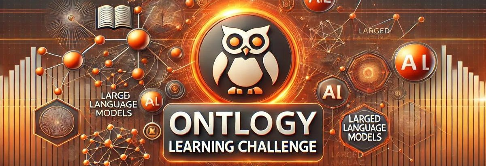

  

<H2 style="color: #000080; text-align: center;">
 The 2nd LLMs4OL Challenge @ ISWC 2025
</H2>
<H3 style="text-align: center;">
<a href="https://sites.google.com/view/llms4ol2025">Website</a> | 
<a href="#">Codalab</a>
 </H3>

## Tasks
The 2nd LLMs4OL Challenge consists of 4 tasks:

* **Task A - Text2Onto**: Extract ontological terminologies and types from a raw text.
* **Task B - Term Typing**: Discover the generalized type for a lexical term.
* **Task C - Taxonomy Discovery**: Discover the taxonomic hierarchy between type pairs.
* **Task D - Non-Taxonomic Relation Extraction**: Identify non-taxonomic, semantic relations between types.

## Evaluation Phases
Two main evaluation phases for the challenge are:

1. **Seen-Eval Testing Phase** – Each selected ontology is split into training and testing subsets. Participants train their systems on the training portion, while the reserved portion is used for evaluation in this phase.
2. **Blind-Eval Testing Phase** – This phase assesses generalizability by introducing new, unseen ontologies for testing, ensuring that models can adapt to novel data beyond their training set.

